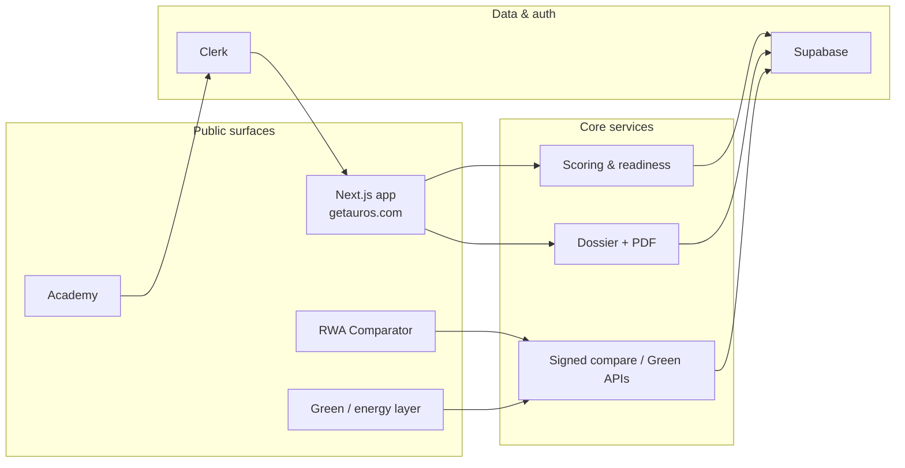

# AUROS

[](https://github.com/Bassanova12560/auros/actions/workflows/ci.yml)

**B2B RWA readiness infrastructure** — structure tokenization dossiers, compare market products, and explore green / energy resource layers — without claiming on-chain issuance or brokerage.

Product site: **[getauros.com](https://getauros.com)** · Responsible disclosure: [SECURITY.md](./SECURITY.md)

---

## One-liner

AUROS helps issuers, advisors, and operators go from **asset description → readiness score → data-room dossier**, with an open **RWA comparator** and a **green / energy resource** product layer (metering, labels, academy).

We prepare the upstream case. Platforms and counsel handle issuance.

---

## Architecture (high level)



Optional Resource Layer packages (`protocol/`, `agent-api/`, IoT bridge) sit beside the main app for metered physical resources — see [`ARL-README.md`](./ARL-README.md). Demos remain human-gated where settlement matters.

---

## Public products

| Product | What it is | Try it |
|---------|------------|--------|
| **RWA readiness** | Score, wizard, AI-assisted dossier, PDF | [Start](https://getauros.com/start) · [Wizard](https://getauros.com/wizard) |
| **Comparator** | Cross-product RWA screener, signed snapshots, reports | [Compare](https://getauros.com/compare) |
| **Green / energy** | Labels, market, CSRD-oriented tools, resource narratives | [Green](https://getauros.com/green) · [Resource layer](https://getauros.com/resource-layer) |
| **Academy** | Tokenized resources / trading / machine-economy tracks | [Academy](https://getauros.com/academy) |
| **Lab** | Experimental / demo consoles (not production settlement) | [Lab surfaces](https://getauros.com/resource-layer) |

Developer-facing docs (public product APIs only): [Developers](https://getauros.com/developers)

---

## Tech stack

- **App:** Next.js (App Router) · TypeScript · Tailwind CSS · Framer Motion  
- **Auth / data:** Clerk · Supabase (RLS-oriented persistence)  
- **Document:** `@react-pdf/renderer` · streaming generation  
- **Engineering highlights:** signed compare snapshots (`auros-compare:v1:`), rate-limited public APIs, Vitest/node test suite, CI on push  
- **Resource layer (optional packages):** Hardhat protocol stubs · agent HTTP API · MQTT proof bridge  

Languages: TypeScript (primary), Solidity (protocol package), Python (optional SDK package).

---

## Try it (public URLs only)

| Surface | URL |
|---------|-----|
| Home | https://getauros.com |
| Compare | https://getauros.com/compare |
| Green hub | https://getauros.com/green |
| Academy | https://getauros.com/academy |
| Resource layer | https://getauros.com/resource-layer |
| Security / disclosure | https://getauros.com/security |

No ops recipes, cron maps, or internal tooling in this README.

---

## Local development (contributors / diligence)

```bash
npm install
cp .env.example .env.local   # fill only what you need — never commit secrets
npm run dev
```

Open [http://localhost:3000](http://localhost:3000). Use `.env.example` as the variable catalog; real keys stay in Vercel / local env only.

WSL note: if `lightningcss` native bindings fail, reinstall deps from WSL — see `docs/DEV-WSL.md`.

---

## Repository posture

This monorepo is the **application source**. Prefer **private** GitHub visibility for the main codebase (secrets history, ops docs, unpaid strategy). A polished README still works when selectively opening the repo or mirroring a thin public showcase (`auros-docs` / docs site).

See [`docs/REPO-VISIBILITY.md`](./docs/REPO-VISIBILITY.md).

---

## Contact & diligence

- Product / partnerships: via [getauros.com](https://getauros.com) contact surfaces  
- Security: **security@getauros.com** (see [SECURITY.md](./SECURITY.md))  
- Contributions: not an open-contribution OSS project today; diligence reviewers — ask for a scoped walkthrough rather than public issue dumps of internals  

---

## License

Proprietary — all rights reserved. `package.json` marks the package as `private`. Contact AUROS for commercial licensing discussions.
